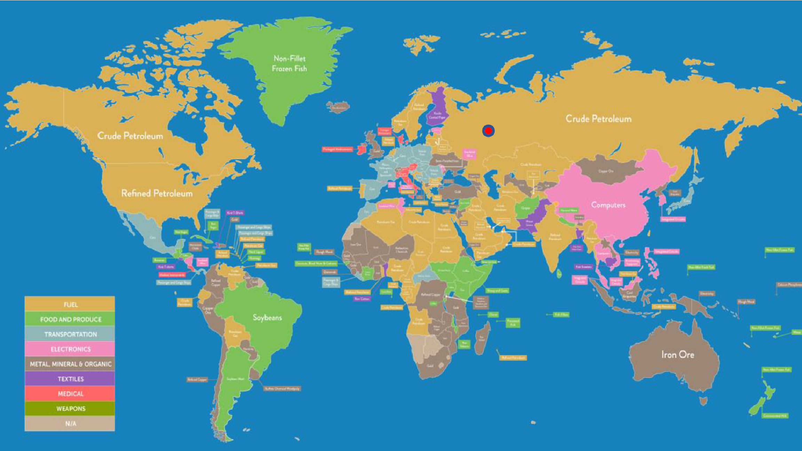

# FlightSimulator-Web-App
Flight-Gear Simulator web application- "Third Mile Stone"- Rest architecture 

General:
  * Web application that serves several addresses.
  * Establishing Tcp/Ip connection with the simulator.
  * Displaying the first-location of the plane/the route of the plane.
  
  
  Description of the addresses:
  
  1.      /display/127.0.0.1/5400 :
  
  -	Displaying worlds map- with our coordinate’s:
  
  
  
   And displaying first location of the plane( by data from Flight-Gear Simulator):
   
   
  
  2.     /display/127.0.0.1/5400/4 :
  
  Notes:
  
   1. Here we samplanig the Lon & Lat of the plane, and displaying the route on the map.
  
   2. The view will refresh itself every 4 seconds.
  
  
  
  3.     /save/127.0.0.1/5400/4/10/flight1 :

  
